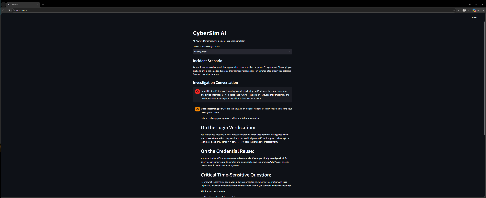

# CyberSim AI

**AI-Powered Cybersecurity Incident Response Simulator**

> 🚧 **Status: Active Development**

CyberSim AI is an interactive cybersecurity training simulator that allows users to investigate simulated security incidents with guidance from AI. Instead of simply providing answers, the system uses the Claude API to challenge the user's reasoning, ask follow-up questions, and guide them through the incident investigation process.

The project is being developed as a hands-on way to combine cybersecurity concepts, incident response, Python development, and generative AI.

## Demo



## Current Features

- Multiple simulated cybersecurity incidents, including phishing, suspicious login, and malware scenarios
- AI-powered investigation guidance using the Claude API
- Multi-turn conversations that preserve investigation context
- Interactive chat interface built with Streamlit
- Incident-specific conversation management
- Input validation to prevent empty submissions

## Tech Stack

- **Python** — core application logic
- **Streamlit** — interactive web interface
- **Anthropic Claude API** — AI-powered cybersecurity guidance and follow-up questions
- **python-dotenv** — secure loading of environment variables
- **Git & GitHub** — version control and project hosting

## Roadmap

- [x] Build initial Streamlit interface
- [x] Integrate the Claude API
- [x] Add multiple cybersecurity incident scenarios
- [x] Implement multi-turn investigation conversations
- [x] Add incident-specific session management
- [ ] Add structured incident-response stages
- [ ] Add simulated security logs and evidence
- [ ] Build investigation scoring and feedback
- [ ] Add difficulty levels
- [ ] Expand the incident scenario library
- [ ] Improve the user interface and visualization
- [ ] Deploy a public demo

## How It Works

1. The user selects a simulated cybersecurity incident.
2. CyberSim AI presents the incident scenario and asks the user to begin investigating.
3. The user's response is sent to the Claude API along with the selected incident and previous conversation history.
4. Claude acts as an incident-response mentor by evaluating the user's reasoning and asking relevant follow-up questions.
5. Streamlit session state preserves the investigation conversation while the user continues analyzing the incident.
6. Selecting a different incident resets the conversation so each investigation remains separate.

## Getting Started

### 1. Clone the repository

```bash
git clone https://github.com/raeshakc13-ui/CyberSim-AI.git
cd CyberSim-AI
```

### 2. Install dependencies

```bash
pip install -r requirements.txt
```

### 3. Configure the API key

Create a `.env` file in the project directory and add your Anthropic API key:

```text
ANTHROPIC_API_KEY=your_api_key_here
```

> Never commit your `.env` file or API key to GitHub.

### 4. Run the application

```bash
streamlit run app.py
```